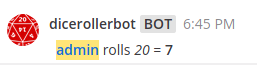
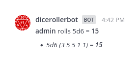
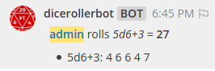
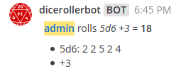
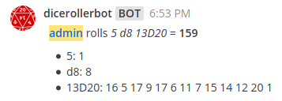

# mattermost-plugin-dice-roller [](https://travis-ci.com/github/moussetc/mattermost-plugin-dice-roller)

**Maintainer:** [@moussetc](https://github.com/moussetc)

This Mattermost plugin adds a `/roll` slash command to roll all kinds of virtual dice.

## Examples
- Use `/roll help` to show examples.
- Use `/roll 20`, `/roll d20` or  `/roll 1D20` to roll a 20-sided die:



- Use `/roll 5d6` to roll five 6-sided dice:



- Use `/roll 5D6+3` to roll five 6-sided dice and add 3 to the result of each dice:



- Use `/roll 5D6 +3` (note the space) to roll five 6-sided dice and add 3 to the total:



- Combine different dice to roll at the same time: `/roll 5 d8 13D20` to roll one 5-sided die, one 8-sided die and thirteen 20-sided dice:



- **[Up to version 3.0.x]** Add `sum` at the end to sum results automatically: `/roll 5 d8 13D20 sum`. In later versions, the sum is always displayed without having to add `sum`.


## Compatibility

Use the following table to find the correct plugin version for your Mattermost server version:

| Mattermost server | Plugin release | Incompatibility |
| --- | --- | --- |
| 5.20 and higher | v3.1.x+ | breaking plugin manifest change |
| 5.12 to 5.19 | v3.0.x | breaking plugin API change |
| 5.2 to 5.11 | v2.x.x | |
| 4.6 to 5.1 | v1.x.x | |
| below | *not supported* |  plugins can't create slash commands |

## Installation and configuration
**In Mattermost 5.20 and later:**
1. In Mattermost, go to **Main Menu > Plugin Marketplace**.
2. Search for the "Dice Roller" plugin, then click **Install** to install it.
3. **Activate the plugin** in the `System Console > Plugins Management > Management` page

If you are running Mattermost 5.19 or earlier, or do not have the Plugin Marketplace enabled, follow these steps:
1. Go to the [Releases page](https://github.com/moussetc/mattermost-plugin-dice-roller/releases) and download the `.tar.gz` package. Supported platforms are: Linux x64, Windows x64, Darwin x64, FreeBSD x64.
2. Use the Mattermost `System Console > Plugins Management > Management` page to upload the `.tar.gz` package
3. **Activate the plugin** in the `System Console > Plugins Management > Management` page

### Configuration Notes in HA

If you are running Mattermost v5.11 or earlier in [High Availability mode](https://docs.mattermost.com/deployment/cluster.html), please review the following:

1. To install the plugin, [use these documented steps](https://docs.mattermost.com/administration/plugins.html#plugin-uploads-in-high-availability-mode)
2. Then, modify the config.json [using the standard doc steps](https://docs.mattermost.com/deployment/cluster.html#updating-configuration-changes-while-operating-continuously) to the following:
```json
 "PluginSettings": {
        // [...]
        "Plugins": {
            "com.github.moussetc.mattermost.plugin.diceroller": {
            },
        },
        "PluginStates": {
            // [...]
            "com.github.moussetc.mattermost.plugin.diceroller": {
                "Enable": true
            },
        }
    }
```


## Development

to build the plugin:
```
make
```

This will produce a single plugin file (with support for multiple architectures) for upload to your Mattermost server:

```
dist/com.example.my-plugin.tar.gz
```

### Deploying with Local Mode

If your Mattermost server is running locally, you can enable [local mode](https://docs.mattermost.com/administration/mmctl-cli-tool.html#local-mode) to streamline deploying your plugin. Edit your server configuration as follows:

```json
{
    "ServiceSettings": {
        ...
        "EnableLocalMode": true,
        "LocalModeSocketLocation": "/var/tmp/mattermost_local.socket"
    },
}
```

and then deploy your plugin:
```
make deploy
```

You may also customize the Unix socket path:
```
export MM_LOCALSOCKETPATH=/var/tmp/alternate_local.socket
make deploy
```

If developing a plugin with a webapp, watch for changes and deploy those automatically:
```
export MM_SERVICESETTINGS_SITEURL=http://localhost:8065
export MM_ADMIN_TOKEN=j44acwd8obn78cdcx7koid4jkr
make watch
```

### Deploying with credentials

Alternatively, you can authenticate with the server's API with credentials:
```
export MM_SERVICESETTINGS_SITEURL=http://localhost:8065
export MM_ADMIN_USERNAME=admin
export MM_ADMIN_PASSWORD=password
make deploy
```

or with a [personal access token](https://docs.mattermost.com/developer/personal-access-tokens.html):
```
export MM_SERVICESETTINGS_SITEURL=http://localhost:8065
export MM_ADMIN_TOKEN=j44acwd8obn78cdcx7koid4jkr
make deploy
```

## Credits
- This plugin is based of the [Mattermost plugin starter template](https://github.com/mattermost/mattermost-plugin-starter-template)
- This project uses a dice icon provided by [openclipart](https://openclipart.org/detail/94501/twentysided-dice) under the [Creative Commons Zero 1.0 Public Domain License](https://creativecommons.org/publicdomain/zero/1.0/).


## How do I share feedback on this plugin?

Feel free to create a GitHub issue or to contact me at `@cmousset` on the [community Mattermost instance](https://pre-release.mattermost.com/) to discuss.
