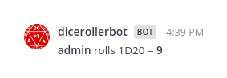
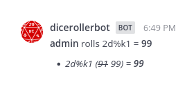
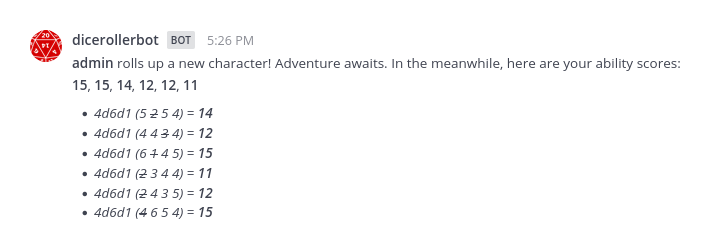

# mattermost-plugin-dice-roller [](https://travis-ci.com/github/moussetc/mattermost-plugin-dice-roller)

**Maintainer:** [@moussetc](https://github.com/moussetc)

This Mattermost plugin adds a `/roll` slash command to roll all kinds of virtual dice.

## Functionality
To roll a set of dice, use the `/roll` command followed by one or several dice expressions.
The results will be shown in the channel, including total results and details as needed.
Capital/small letters are interchangeable.

- **Help:**
  Use `/roll help` to show help.
- **Basic dice:**
  `NdX` is `N` dice, each with `X` sides.
  `N` is assumed to be `1` if left out.
  `X` can be `%` to mean `100`.
  For example,
  - use `/roll d20` or `/roll 1D20` to roll a 20-sided die:

    
  - use `/roll 5d6` to roll five 6-sided dice:

    
- **Math:**
  Integers and operators `()+-*/` have their usual meanings, except `/` rounds down.
  This means that
  - you can add modifiers to any roll. For example,

    `/roll 5d6+5`:

    
  - you can roll different kinds of dice and get a total. For example,

    `/roll 4d6+3d4`:

    
  - you can use the dice roller as calculator. For example,

    `/roll (5+3-2)*7/3`:

    
- **Keep/drop:**
  When you roll more than one die, you can add an instruction to the end to keep some and drop other dice:
  - `kM` or `khM` will keep the highest `M` dice.
  - `klM` will keep the lowest `M` dice.
  - `dM` or `dlM` will drop the lowest `M` dice.
  - `dhM` will drop the highest `M` dice.

  For example,
  - `/roll 4d6k3-3d4dl1`:

    
  - `/roll d2%k1`:

    
- **Comma separation**:
  You can provide several roll expressions in one command using commas to delimit them.
  The total for each expression will be shown, but there will be no total adding together unrelated expressions.
  For example,

  `/roll 1d20+4, 1d6+2`:

  
- **Labels:**
  After any roll expression, you can add a space and then a description.
  This can be useful to keep track of comma separated expressions.
  You can also label expressions within parentheses, causing a sum to be shown for that subexpression.
  For example,

  `/roll 1d20+4 to hit, (1d6+2 slashing)+(2d8 radiant) damage`:

  

### Functionality specific to DnD 5e

- **Advantage/disadvantage:**
  As a special shortcut, `dXa` means `2dXk1`, and `dXd` means `2dXkl1`.
  For example,

  `/roll d20a`:

  
- **Stats:**
  Use `/roll stats` to roll stats for a DnD 5e character (`4d6d1` 6 times):

  
- **Death save:**
  Use `/roll death save` to roll a death save for DnD 5e:

  

## Compatibility

Use the following table to find the correct plugin version for your Mattermost server version:

| Mattermost server | Plugin release | Incompatibility |
| --- | --- | --- |
| 5.20 and higher | v3.1.x+ | breaking plugin manifest change |
| 5.12 to 5.19 | v3.0.x | breaking plugin API change |
| 5.2 to 5.11 | v2.x.x | |
| 4.6 to 5.1 | v1.x.x | |
| below | *not supported* |  plugins can't create slash commands |

## Installation and configuration
**In Mattermost 5.20 and later:**
1. In Mattermost, go to **Main Menu > Plugin Marketplace**.
2. Search for the "Dice Roller" plugin, then click **Install** to install it.
3. **Activate the plugin** in the `System Console > Plugins Management > Management` page

If you are running Mattermost 5.19 or earlier, or do not have the Plugin Marketplace enabled, follow these steps:
1. Go to the [Releases page](https://github.com/moussetc/mattermost-plugin-dice-roller/releases) and download the `.tar.gz` package. Supported platforms are: Linux x64, Windows x64, Darwin x64, FreeBSD x64.
2. Use the Mattermost `System Console > Plugins Management > Management` page to upload the `.tar.gz` package
3. **Activate the plugin** in the `System Console > Plugins Management > Management` page

### Configuration Notes in HA

If you are running Mattermost v5.11 or earlier in [High Availability mode](https://docs.mattermost.com/deployment/cluster.html), please review the following:

1. To install the plugin, [use these documented steps](https://docs.mattermost.com/administration/plugins.html#plugin-uploads-in-high-availability-mode)
2. Then, modify the config.json [using the standard doc steps](https://docs.mattermost.com/deployment/cluster.html#updating-configuration-changes-while-operating-continuously) to the following:
```json
 "PluginSettings": {
        // [...]
        "Plugins": {
            "com.github.moussetc.mattermost.plugin.diceroller": {
            },
        },
        "PluginStates": {
            // [...]
            "com.github.moussetc.mattermost.plugin.diceroller": {
                "Enable": true
            },
        }
    }
```

# Development

To avoid having to manually install your plugin, build and deploy your plugin using one of the following options.

### Deploying with Local Mode

If your Mattermost server is running locally, you can enable [local mode](https://docs.mattermost.com/administration/mmctl-cli-tool.html#local-mode) to streamline deploying your plugin. Edit your server configuration as follows:

```json
{
    "ServiceSettings": {
        ...
        "EnableLocalMode": true,
        "LocalModeSocketLocation": "/var/tmp/mattermost_local.socket"
    }
}
```

and then deploy your plugin:
```
make deploy
```

You may also customize the Unix socket path:
```
export MM_LOCALSOCKETPATH=/var/tmp/alternate_local.socket
make deploy
```

If developing a plugin with a webapp, watch for changes and deploy those automatically:
```
export MM_SERVICESETTINGS_SITEURL=http://localhost:8065
export MM_ADMIN_TOKEN=j44acwd8obn78cdcx7koid4jkr
make watch
```

### Deploying with credentials

Alternatively, you can authenticate with the server's API with credentials:
```
export MM_SERVICESETTINGS_SITEURL=http://localhost:8065
export MM_ADMIN_USERNAME=admin
export MM_ADMIN_PASSWORD=password
make deploy
```

or with a [personal access token](https://docs.mattermost.com/developer/personal-access-tokens.html):
```
export MM_SERVICESETTINGS_SITEURL=http://localhost:8065
export MM_ADMIN_TOKEN=j44acwd8obn78cdcx7koid4jkr
make deploy
```

## What's next?
- Better code testing
- Generate roll results as accurate image (number of dice, number of faces...)

## Credits
- This plugin is based of the [Mattermost plugin starter template](https://github.com/mattermost/mattermost-plugin-starter-template)
- This project uses a dice icon provided by [openclipart](https://openclipart.org/detail/94501/twentysided-dice) under the [Creative Commons Zero 1.0 Public Domain License](https://creativecommons.org/publicdomain/zero/1.0/).


## How do I share feedback on this plugin?

Feel free to create a GitHub issue or to contact me at `@cmousset` on the [community Mattermost instance](https://pre-release.mattermost.com/) to discuss.
